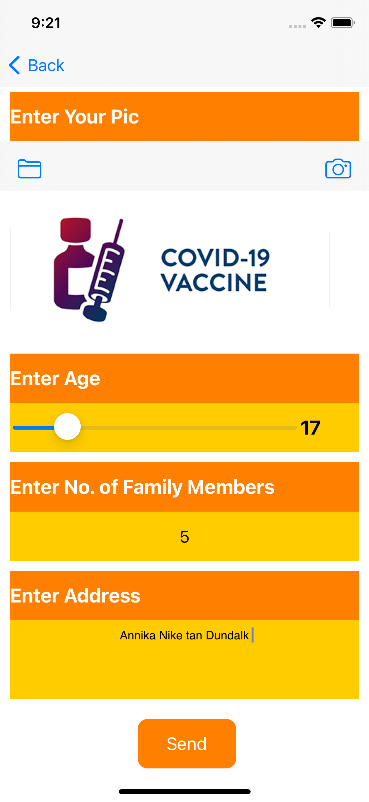

# CovidSurveyApp
All uielements

In this Application I have used all the kind of uielements like:
button,
label,
textfield,
textarea,
datetimepicker,
segmentcontrol,
slider,
steppr,
switch,
alert ,
tableview,
imagview,
imgpickerview,
toolbar,
tabbar,

